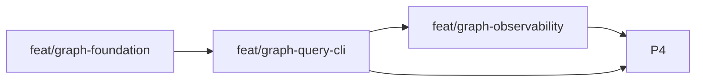

# Approach: Code Graph

## Strategy

Use a phased sequential rollout with one foundational partition followed by query, observability, and integration partitions. The first partition establishes the optional graph subsystem itself: artifact layout, SQLite schema, graph IR, seeded-area loading, and graph build/status behavior. Once those contracts are stable, query commands can evolve with lower risk, observability can then instrument the settled command surface, and the final partition can wire the capability into Cicadas documentation, templates, and regression coverage without forcing rework in every downstream doc.

This initiative is brownfield and terminal-first, so the approach prioritizes backward compatibility and explicit availability over aggressive automation. There is no attempt to hide graph setup inside normal Cicadas commands. Instead, the implementation makes graph support visible, optional, and inspectable: build explicitly, query deterministically, measure usefulness locally, and fall back cleanly to existing canon and routing artifacts when graph support is absent.

## Partitions (Feature Branches)

### Partition 1: Graph Foundation → `feat/graph-foundation`
**Modules**: `src/cicadas/scripts/graph.py`, `src/cicadas/scripts/graph_ir.py`, `src/cicadas/scripts/graph_store.py`, `src/cicadas/scripts/graph_build.py`, `src/cicadas/scripts/graph_extract/common.py`, `src/cicadas/scripts/command_registry.py`, `.cicadas/graph`
**Scope**: Introduce the optional graph subsystem, define the SQLite-backed storage contract, create build/status commands, and implement seeded area loading from canon slices or fallback routing artifacts.
**Dependencies**: None

#### Artifact Type
library

#### How to Run
- teardown: `N/A`

#### Acceptance Criteria
- [ ] Running `python src/cicadas/scripts/cicadas.py graph build` creates `.cicadas/graph/codegraph.sqlite` and `.cicadas/graph/metadata.json` for a supported repo.
- [ ] Running `python src/cicadas/scripts/cicadas.py graph status` after a successful build exits 0 and reports build ID, freshness, and indexed language coverage.
- [ ] When canon slices or equivalent routing artifacts exist, area assignments in the graph are seeded from them rather than derived only from directory heuristics.

#### Implementation Steps
1. Define the graph IR, node/edge kinds, and SQLite schema/versioning strategy.
2. Implement graph artifact paths and metadata handling under `.cicadas/graph/`.
3. Build the initial extraction pipeline with shared file walking, structural classification, and seeded area loading.
4. Add the `graph.py` dispatcher plus `graph build` and `graph status` command plumbing to the common CLI.
5. Add core temp-repo tests for absent graph, successful build, and status behavior.

### Partition 2: Query Commands → `feat/graph-query-cli`
**Modules**: `src/cicadas/scripts/graph_query.py`, `src/cicadas/scripts/graph_extract/python.py`, `src/cicadas/scripts/graph_extract/javascript.py`, `src/cicadas/scripts/graph_extract/java.py`, `src/cicadas/scripts/graph_extract/rust.py`, `src/cicadas/scripts/command_registry.py`
**Scope**: Implement the public query commands for routing, test discovery, caller/callee lookup, and signature blast-radius analysis using the graph foundation and language-aware extraction/enrichment where available.
**Dependencies**: Requires Query Commands

#### Artifact Type
cli

#### How to Run
- teardown: `N/A`

#### Acceptance Criteria
- [ ] `python src/cicadas/scripts/cicadas.py graph area <artifact>` exits 0 and returns a ranked owning-area summary when graph artifacts are available.
- [ ] `python src/cicadas/scripts/cicadas.py graph signature-impact <symbol>` returns likely callers, nearby tests, and adjacent areas with explicit freshness and coverage context.
- [ ] If graph artifacts are missing or coverage is partial, graph query commands explain the limitation and suggest fallback artifacts instead of silently failing or overstating confidence.

#### Implementation Steps
1. Add query planning and ranked result formatting for area, neighbors, tests, callers, callees, and signature-impact.
2. Implement language-specific extraction/enrichment hooks and coverage reporting.
3. Add `graph route` as a secondary natural-language routing helper once artifact-led commands are stable.
4. Register the graph command family in the common CLI and align help output.
5. Add end-to-end tests for query commands on temp repos with representative callers/tests.

### Partition 3: Graph Observability → `feat/graph-observability`
**Modules**: `src/cicadas/scripts/graph_usage.py`, `.cicadas/graph/usage.jsonl`, query command wrappers in `src/cicadas/scripts/graph_query.py`
**Scope**: Add graph-local append-only usage logging, end-to-end timing capture, usefulness tagging hooks, and usage summary/visualization commands.
**Dependencies**: Requires Graph Foundation

#### Artifact Type
cli

#### How to Run
- teardown: `N/A`

#### Acceptance Criteria
- [ ] Each graph-backed command invocation appends a JSON object to `.cicadas/graph/usage.jsonl` containing initiative/work type, query kind, operation name, and `end_to_end_ms`.
- [ ] `python src/cicadas/scripts/cicadas.py graph usage` summarizes command frequency, end-to-end timings, and usefulness signals from the local usage log.
- [ ] Usage summaries can be filtered by initiative and continue to work even when some usefulness tags or overlap fields are absent. 

#### Implementation Steps
1. Define the usage log schema and helper for best-effort append-only writes.
2. Wrap graph commands with end-to-end timing capture and operation-name tagging.
3. Capture initial usefulness tags and overlap-ready metadata without coupling query success to log writes.
4. Implement table/json/html usage summaries.
5. Add tests for usage logging, timing fields, filtering, and corrupted-log handling.

### Partition 4: Workflow Integration & Docs → `feat/graph-workflow-integration`
**Modules**: `src/cicadas/emergence/clarify.md`, `src/cicadas/emergence/bug-fix.md`, `src/cicadas/emergence/tweak.md`, `src/cicadas/SKILL.md`, `README.md`, `src/cicadas/README.md`, `src/cicadas/templates/routing-guide.md`, `src/cicadas/templates/area-map.md`, `tests/`
**Scope**: Teach Cicadas when to use graph-backed routing, update routing/canon guidance, and add regression coverage for graph-optional behavior and instruction changes.
**Dependencies**: Requires Query Commands and Graph Observability

#### Artifact Type
library

#### How to Run
- teardown: `N/A`

#### Acceptance Criteria
- [ ] Clarify, bug-fix, tweak, and general Cicadas skill guidance mention graph-backed routing conditionally when work begins from a symptom, symbol, or failing test.
- [ ] README and internal docs explain that graph support is optional, explicitly built, and backed by `.cicadas/graph/`.
- [ ] Regression tests verify that non-graph workflows still behave correctly when graph artifacts are absent and that graph guidance remains conditional rather than mandatory.

#### Implementation Steps
1. Update skill and emergence guidance to prefer graph-backed routing when available and existing canon artifacts otherwise.
2. Update user-facing docs and routing templates to mention the optional graph subsystem and its observability/reporting behavior.
3. Add regression tests covering absent-graph fallback messaging and graph-aware docs/template expectations.
4. Review command names, artifact paths, and log terminology for consistency across specs and docs.

## Sequencing

Graph Foundation must land first because every other partition depends on stable graph artifact paths, metadata, and seeded area modeling. Query Commands come next so the public command set and output semantics are stable before observability starts wrapping them. Graph Observability follows once the user-visible graph operations are settled, and Workflow Integration & Docs comes last so the guidance and regression coverage reflect the final command and logging contracts.



### Partitions DAG

> This block is machine-readable. It drives automatic worktree creation in `branch.py`.
> - `depends_on: []` → partition runs in parallel (gets its own git worktree)
> - `depends_on: [feat/other]` → partition is sequential (plain branch, waits for dependency)
> - Omit this block entirely to fall back to sequential-only behavior (backward compatible).

```yaml partitions
- name: feat/graph-foundation
  modules: [src/cicadas/scripts/graph_ir.py, src/cicadas/scripts/graph_store.py, src/cicadas/scripts/graph_build.py, src/cicadas/scripts/graph_extract/common.py, .cicadas/graph]
  depends_on: []

- name: feat/graph-query-cli
  modules: [src/cicadas/scripts/graph_query.py, src/cicadas/scripts/graph_extract/python.py, src/cicadas/scripts/graph_extract/javascript.py, src/cicadas/scripts/graph_extract/java.py, src/cicadas/scripts/graph_extract/rust.py, src/cicadas/scripts/command_registry.py]
  depends_on: [feat/graph-foundation]

- name: feat/graph-observability
  modules: [src/cicadas/scripts/graph_usage.py, src/cicadas/scripts/graph_query.py, .cicadas/graph/usage.jsonl]
  depends_on: [feat/graph-query-cli]

- name: feat/graph-workflow-integration
  modules: [src/cicadas/emergence, src/cicadas/templates, src/cicadas/SKILL.md, README.md, src/cicadas/README.md, tests]
  depends_on: [feat/graph-observability]
```

## Migrations & Compat

No source-code or user-data migration is required because graph artifacts are optional, derived, and local to `.cicadas/graph/`. Compatibility work centers on behavior:
- Existing Cicadas commands must remain unchanged when graph artifacts do not exist.
- Existing repos without canon slices must still be indexable through fallback structural area derivation.
- Graph schema changes should prefer rebuild-over-migrate in v1 because graph state is reproducible.

## Risks & Mitigations

| Risk | Mitigation |
|------|------------|
| Graph foundation contracts churn and destabilize downstream docs/tests | Land the artifact layout, metadata schema, and seeded-area model first before wiring guidance and reports |
| Query commands become too verbose or too confident | Keep the public command set narrow, return ranked summaries, and always show freshness/coverage context |
| Observability logging becomes invasive or brittle | Make logging best-effort, append-only, and isolated from command success paths |
| Integration guidance drifts from actual command behavior | Sequence docs/tests after query and observability contracts stabilize and add regression checks |

## Alternatives Considered

Building everything in a single feature branch was rejected because it would mix storage contracts, query semantics, observability, and documentation changes into one hard-to-review stream. Running the partitions in parallel was also rejected because this initiative benefits more from stable contracts between phases than from concurrency. A docs-first partition was rejected because the graph command names, output fields, and log schema need to stabilize first.
