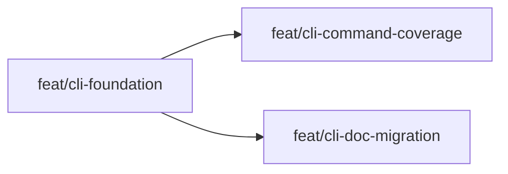

# Approach: common-cli

## Strategy
Use a phased approach with one short blocking foundation partition followed by two parallel feature partitions. First, establish the common CLI entrypoint and command registry inside `src/cicadas/scripts/` so the command contract is real and stable. Once that foundation exists, split the remaining work between command coverage/parity and documentation migration, since those can proceed concurrently as long as the subcommand names are locked early.

## Partitions (Feature Branches)

### Partition 1: CLI Foundation → `feat/cli-foundation`
**Modules**: `src/cicadas/scripts/cicadas.py`, `src/cicadas/scripts/command_registry.py`, `tests/test_cli.py`
**Scope**: Introduce the canonical common CLI script, define the centralized command registry, establish top-level help behavior, and prove the dispatch pattern with a small representative command set.
**Dependencies**: None

#### Artifact Type
cli

#### How to Run
- start: omitted for CLI artifact
- teardown: not applicable

#### Acceptance Criteria
- [ ] `python src/cicadas/scripts/cicadas.py --help` exits `0` and prints a usage block that includes at least `status`, `check`, and `kickoff`.
- [ ] `python src/cicadas/scripts/cicadas.py status` exits `0` in this repo and reports project status instead of failing with an argument parser error.
- [ ] A new CLI-focused test file runs via `python -m pytest tests/test_cli.py` and covers top-level help plus representative subcommand dispatch.

#### Implementation Steps
1. Create `src/cicadas/scripts/cicadas.py` with top-level `argparse` handling and subcommand dispatch.
2. Add `src/cicadas/scripts/command_registry.py` to centralize command metadata and parser registration.
3. Wire a small representative set of commands first and add initial CLI tests that lock the public contract.

### Partition 2: Command Coverage and Parity → `feat/cli-command-coverage`
**Modules**: `src/cicadas/scripts/*.py`, `tests/`
**Scope**: Extend the common CLI to wrap all deterministic Cicadas scripts, refactor script entrypoints where needed to expose callable functions, and add parity coverage for important lifecycle commands.
**Dependencies**: Requires Partition 1

#### Artifact Type
cli

#### How to Run
- start: omitted for CLI artifact
- teardown: not applicable

#### Acceptance Criteria
- [ ] Each user-facing deterministic script in `src/cicadas/scripts/` has a corresponding CLI subcommand exposed through `python src/cicadas/scripts/cicadas.py --help`.
- [ ] `python src/cicadas/scripts/cicadas.py create-lifecycle common-cli --help`, `python src/cicadas/scripts/cicadas.py validate-skill --help`, and `python src/cicadas/scripts/cicadas.py get-events --help` each exit `0` and show command-specific usage.
- [ ] Representative parity tests confirm that CLI-dispatched commands preserve expected exit behavior for at least `status`, `check`, and one mutating command in a temp repo fixture.

#### Implementation Steps
1. Audit existing scripts and standardize callable entrypoints where parser logic is currently inline.
2. Register the full deterministic command surface in the common CLI, including lower-frequency commands such as events, review, synthesize, tokens, register-existing, and unarchive where they are meant to stay public.
3. Expand automated coverage to verify help output and representative dispatch parity against existing behavior.

### Partition 3: Documentation and Skill Migration → `feat/cli-doc-migration`
**Modules**: `README.md`, `src/cicadas/README.md`, `src/cicadas/SKILL.md`, `src/cicadas/emergence/*.md`, related docs that teach direct script invocation
**Scope**: Update user-facing markdown and skill guidance to teach the common CLI as the public interface while preserving Cicadas methodology semantics and the Anthropic skill layout.
**Dependencies**: Requires Partition 1

#### Artifact Type
cli

#### How to Run
- start: omitted for CLI artifact
- teardown: not applicable

#### Acceptance Criteria
- [ ] Core docs and skill instructions use `python {cicadas-dir}/scripts/cicadas.py ...` for standard lifecycle examples instead of direct `python {cicadas-dir}/scripts/*.py` invocations.
- [ ] The updated docs still describe the same lifecycle boundaries, PR rules, and agent operations as before, with only the invocation surface changed.
- [ ] A repo search for direct script invocations in the agreed user-facing docs returns only intentional exceptions with an explanatory note. <!-- NEEDS MANUAL REVIEW -->

#### Implementation Steps
1. Audit the main README, orchestrator README, SKILL, and emergence docs for public command examples.
2. Update standard lifecycle instructions to use the common CLI and align phrasing with the final subcommand names.
3. Review for drift so the docs present one canonical command surface without implying a machine-global install.

## Sequencing

`feat/cli-foundation` must land first because it defines the command names, help strategy, and dispatch pattern the other partitions rely on. After that, `feat/cli-command-coverage` and `feat/cli-doc-migration` can proceed in parallel: one extends behavioral coverage while the other updates the taught interface.



### Partitions DAG

> This block is machine-readable. It drives automatic worktree creation in `branch.py`.
> - `depends_on: []` → partition runs in parallel (gets its own git worktree)
> - `depends_on: [feat/other]` → partition is sequential (plain branch, waits for dependency)
> - Omit this block entirely to fall back to sequential-only behavior (backward compatible).

```yaml partitions
- name: feat/cli-foundation
  modules: [src/cicadas/scripts/cicadas.py, src/cicadas/scripts/command_registry.py, tests/test_cli.py]
  depends_on: []

- name: feat/cli-command-coverage
  modules: [src/cicadas/scripts]
  depends_on: [feat/cli-foundation]

- name: feat/cli-doc-migration
  modules: [README.md, src/cicadas/README.md, src/cicadas/SKILL.md, src/cicadas/emergence]
  depends_on: [feat/cli-foundation]
```

## Migrations & Compat
No project-state migration is required because `.cicadas/` data formats stay unchanged. Compatibility should be handled at the command layer: direct script entrypoints may remain available during the transition, but docs and agent instructions should teach the common CLI as the canonical surface. If any legacy direct invocation is intentionally retained in docs, it should be clearly framed as compatibility or implementation detail rather than the preferred path.

## Risks & Mitigations
| Risk | Mitigation |
|------|------------|
| Subcommand names are chosen poorly and become sticky across docs and agent behavior | Lock the naming scheme in the foundation partition before parallel work begins. |
| Some scripts are harder to wrap cleanly than expected because parsing and logic are tightly coupled | Refactor only enough to expose callable entry functions, and lean on parity tests to catch regressions. |
| Documentation migration diverges from the implemented command surface | Keep command metadata centralized and update docs only after the foundation partition establishes the public names. |

## Alternatives Considered
Keeping the current many-script interface was rejected because it leaves discoverability and agent ergonomics unresolved. Moving immediately to a package-style Python entrypoint outside `scripts/` was rejected because it conflicts with the Anthropic Standard Skills layout and overcommits Cicadas to a Python-product boundary that the project does not want yet.
