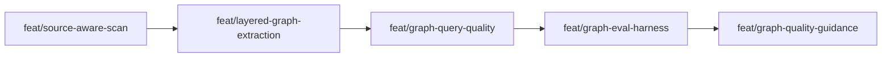

# Approach: Graph Quality & Optional Tree-sitter Extraction

## Strategy

Use a staged, mostly sequential rollout. Source classification lands first because repo mode and graph build should share the same code-vs-doc understanding. Graph extraction metadata and Tree-sitter optionality come next so query output can distinguish fallback, structural, resolver, and semantic facts. Query and usage improvements follow once graph facts are richer and consistently labeled. A bounded mega-repo evaluation harness then validates the graph against synthetic scale fixtures and private Jira/Confluence scenario suites. Documentation and agent guidance finish last so they describe the final command and evaluation behavior rather than speculative internals.

The initiative uses initiative-only PRs, so feature branches do not need feature-boundary PR tasks. Each partition still maps to a registered feature branch for scope control and Reflect discipline.

## Partitions (Feature Branches)

### Partition 1: Source-Aware Scan Classification -> `feat/source-aware-scan`
**Modules**: `src/cicadas/scripts/scan_repo.py`, `src/cicadas/scripts/utils.py`, `tests/test_scan_repo.py`
**Scope**: Add source/docs/generated classification helpers, separate scan metrics, and revise repo mode classification so documentation volume does not independently force large/mega repo mode.
**Dependencies**: None

#### Artifact Type
cli

#### How to Run
- teardown: `N/A`

#### Acceptance Criteria
- [ ] Markdown-heavy fixture with at least 5,000 `.md` files and fewer than 100 code files classifies as `normal-repo` unless topology independently raises it.
- [ ] `repo.json` includes separate total, meaningful, code, test, documentation, generated/local, code LOC, and documentation LOC metrics.
- [ ] `repo-context.md` explains source volume and documentation/context volume separately.
- [ ] Existing SDD exclusion tests continue to pass.

#### Implementation Steps
1. Define shared code/test/docs/config/generated classification helpers.
2. Add `SourceMetrics`-style counters to scan summaries and metadata.
3. Update `_scale_class` and evidence generation to use code volume as the primary scale floor.
4. Add regression tests for markdown-heavy docs and existing scan exclusions.

### Partition 2: Layered Extraction and Optional Tree-sitter -> `feat/layered-graph-extraction`
**Modules**: `src/cicadas/scripts/graph_ir.py`, `src/cicadas/scripts/graph_build.py`, `src/cicadas/scripts/graph_extract`, `tests/test_graph.py`
**Scope**: Standardize extraction source/confidence metadata, add Tree-sitter capability detection, add Rust structural extraction with fallback, preserve JS/TS fallback structural extraction with capability reporting, and fix Python streamed-build test links.
**Dependencies**: Requires Partition 1

#### Artifact Type
cli

#### How to Run
- teardown: `N/A`

#### Acceptance Criteria
- [ ] Graph metadata reports Tree-sitter capability per supported language without failing when packages are absent.
- [ ] Graph nodes/edges produced by fallback, Python AST, Tree-sitter, and semantic paths carry extraction source and confidence metadata.
- [ ] Python `graph tests <symbol>` returns linked tests from a normal streamed graph build.
- [ ] Rust graph build reports explicit unavailable/fallback coverage when Tree-sitter Rust support is absent.
- [ ] If Tree-sitter support is locally available or adapter-stubbed in tests, Rust structural facts are indexed; JS/TS reports capability while continuing to use fallback structural extraction until a parser-backed extractor is added.

#### Implementation Steps
1. Add optional `tree_sitter_adapter.py` with package/grammar capability probes.
2. Standardize metadata helpers for extraction source, confidence, and semantic resolution.
3. Fix Python extractor state so test-node mappings survive streamed emission.
4. Add JS/TS Tree-sitter capability reporting while preserving regex fallback extraction.
5. Add optional Tree-sitter Rust extractor and accurate analyzer status reporting.

### Partition 3: Query Quality and Value Observability -> `feat/graph-query-quality`
**Modules**: `src/cicadas/scripts/graph_store.py`, `src/cicadas/scripts/graph_query.py`, `src/cicadas/scripts/graph_usage.py`, `src/cicadas/scripts/graph.py`, `tests/test_graph.py`
**Scope**: Remove arbitrary search truncation, add deterministic indexed candidate generation, rank neighbors from graph connectivity, and add bounded result summaries plus overlap-ready usage fields.
**Dependencies**: Requires Partition 2

#### Artifact Type
cli

#### How to Run
- teardown: `N/A`

#### Acceptance Criteria
- [ ] Search fixture with more than 250 low-quality matches still returns the intended operational/UI symbol in the top 5.
- [ ] Search reports whether it used FTS or basic deterministic search.
- [ ] Neighbor query ranks graph-connected areas above unrelated seeded metadata siblings.
- [ ] Query output identifies graph-connected vs metadata-fallback neighbor basis.
- [ ] Usage entries include bounded result summaries for areas/files/symbols/tests where applicable.
- [ ] Usage reports tolerate old entries without result summaries.

#### Implementation Steps
1. Add optional FTS/index initialization and deterministic fallback search candidate logic.
2. Move search candidate ordering out of arbitrary SQLite row order.
3. Implement area adjacency aggregation from graph edges.
4. Add result summary payloads to query metadata and usage logging.
5. Add overlap-ready usage report fields while preserving backward compatibility.

### Partition 4: Mega-Repo Evaluation Harness -> `feat/graph-eval-harness`
**Modules**: `src/cicadas/scripts/graph_eval.py`, `src/cicadas/scripts/graph.py`, `tests/test_graph_eval.py`, `tests/fixtures`
**Scope**: Add a bounded local evaluation harness for synthetic scale and private mega-repo scenario suites, including scenario schema, command/reporting behavior, and metrics for search/routing/neighbors/test discovery.
**Dependencies**: Requires Partition 3

#### Artifact Type
cli

#### How to Run
- teardown: `N/A`

#### Acceptance Criteria
- [ ] `graph eval --repo <path> --scenario-file <jsonl> --output <path>` runs against a local external repo path without packaging that repo.
- [ ] Scenario JSONL supports search, route, neighbors, tests, callers, callees, and signature-impact expectations.
- [ ] Synthetic scale fixtures cover doc-heavy repos, search candidate noise, dense area adjacency, support/generated noise, and parser-unavailable fallback.
- [ ] Evaluation reports include JSON output and a concise human-readable summary with top-N hit, rank, latency, coverage, and failure reasons.
- [ ] Private Jira/Confluence scenario files are documented as local/gitignored inputs.

#### Implementation Steps
1. Define scenario JSONL schema and result schema.
2. Add `graph eval` command dispatch or standalone script integrated into `graph.py`.
3. Add synthetic repo/scenario generator utilities for public tests.
4. Implement metrics aggregation for search, routing, neighbors, tests, and signature-impact scenarios.
5. Document private Jira/Confluence scenario usage without committing proprietary fixtures.

### Partition 5: Workflow Integration and Regression Hardening -> `feat/graph-quality-guidance`
**Modules**: `src/cicadas/SKILL.md`, `src/cicadas/emergence`, `README.md`, `src/cicadas/README.md`, `tests/test_templates.py`, `tests`
**Scope**: Update guidance for the full graph workflow, document Tree-sitter optionality, fallback coverage, and eval harness usage, and run final focused scan/graph/eval/template regression coverage.
**Dependencies**: Requires Partition 4

#### Artifact Type
library

#### How to Run
- teardown: `N/A`

#### Acceptance Criteria
- [ ] Skill and emergence guidance mention `graph search`, `neighbors`, `callers`, `callees`, `tests`, `signature-impact`, `--exclude-tests`, and fallback behavior.
- [ ] Docs state Tree-sitter is optional and explain what improves when it is available.
- [ ] Docs explain the bounded mega-repo eval harness and how private Jira/Confluence scenarios stay outside the public repo.
- [ ] Template/guidance tests verify graph guidance remains conditional.
- [ ] Focused scan, graph, eval, and template test suites pass.

#### Implementation Steps
1. Update skill graph command guidance and branch-start routing notes.
2. Update emergence modules and routing templates where graph behavior is referenced.
3. Update README and internal docs for source-aware scan metrics and Tree-sitter optionality.
4. Run focused test suites and repair regressions.

## Sequencing

Partition 1 is foundational. Partitions 2 and 3 are sequential because query behavior depends on extraction metadata and richer graph facts. Partition 4 depends on stable query outputs so it can evaluate real behavior instead of chasing command churn. Partition 5 should wait until command behavior, metadata names, and eval reports are stable.



### Partitions DAG

```yaml partitions
- name: feat/source-aware-scan
  modules: [src/cicadas/scripts/scan_repo.py, src/cicadas/scripts/utils.py, tests/test_scan_repo.py]
  depends_on: []

- name: feat/layered-graph-extraction
  modules: [src/cicadas/scripts/graph_ir.py, src/cicadas/scripts/graph_build.py, src/cicadas/scripts/graph_extract, tests/test_graph.py]
  depends_on: [feat/source-aware-scan]

- name: feat/graph-query-quality
  modules: [src/cicadas/scripts/graph_store.py, src/cicadas/scripts/graph_query.py, src/cicadas/scripts/graph_usage.py, src/cicadas/scripts/graph.py, tests/test_graph.py]
  depends_on: [feat/layered-graph-extraction]

- name: feat/graph-eval-harness
  modules: [src/cicadas/scripts/graph_eval.py, src/cicadas/scripts/graph.py, tests/test_graph_eval.py, tests/fixtures]
  depends_on: [feat/graph-query-quality]

- name: feat/graph-quality-guidance
  modules: [src/cicadas/SKILL.md, src/cicadas/emergence, README.md, src/cicadas/README.md, tests/test_templates.py]
  depends_on: [feat/graph-eval-harness]
```

## Migrations & Compat

No durable user-data migration is required. Repo scan artifacts and graph artifacts are generated state and can be rewritten by `scan-repo` and `graph build`. Usage logs are append-only and must remain backward-compatible; new reports should treat missing `result_summary` and `overlap` fields as unknown.

Tree-sitter is optional. Environments without Tree-sitter should show analyzer metadata such as `rust=unavailable` or `javascript=fallback-structural` and continue using fallback extractors.

Mega-repo evaluation scenarios for Jira and Confluence are local inputs, not distributed fixtures. Public tests should use synthetic generators and schema validation. Private scenario files should live in gitignored local paths such as `.cicadas/evals/*.jsonl`.

## Risks & Mitigations

| Risk | Mitigation |
|------|------------|
| Tree-sitter package APIs differ | Isolate imports in `tree_sitter_adapter.py` and support unavailable/fallback paths first. |
| FTS unavailable in local SQLite | Detect FTS support and use deterministic SQL fallback. |
| Source classification undercounts real complexity | Let topology evidence raise mode and show classification evidence in repo metadata. |
| Query changes break existing tests | Preserve command names and output headers; update tests around additive metadata only. |
| Java semantic path regresses | Keep Java changes limited to metadata alignment during MVP. |
| Private mega-repo evals become required for public CI | Keep public CI on synthetic fixtures and make Jira/Confluence evals opt-in local runs. |

## Alternatives Considered

Making Tree-sitter mandatory was rejected because it violates Cicadas' lightweight runtime contract. Replacing the graph store with an external graph database was rejected because current graph state is local and derived. Keeping neighbor routing metadata-only was rejected because it does not address the mega-repo efficacy problem. Splitting the eval harness into a later initiative was rejected because this initiative needs proof that graph quality improves on mega-repo workflows, not just cleaner internals. Skipping usage value proxies was rejected because the graph initiative explicitly needs evidence of value, not only command frequency.
