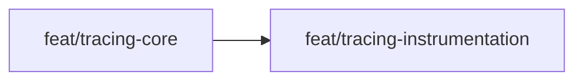

# Approach: otel-instrumentation

## Strategy

Sequential two-partition approach. The core tracing module must exist before any script can be instrumented, so P1 ships first. P2 then instruments all lifecycle scripts in one branch. The initiative uses a single initiative PR at the end (no feature PRs per lifecycle.json).

## Partitions (Feature Branches)

### Partition 1: Tracing Core → `feat/tracing-core`

**Modules**: `src/cicadas/scripts/tracing.py`, `pyproject.toml`, `src/cicadas/scripts/init.py`, `tests/test_tracing.py`

**Scope**: Create the `tracing.py` module with all OTel helpers and null objects. Add the optional dependency group to `pyproject.toml`. Add the tracing config stub to `init.py`'s generated `config.json` template. Write unit tests for `tracing.py`.

**Dependencies**: None

#### Artifact Type
cli / library

#### How to Run
- start: _(library — no persistent process)_
- ready-check: `PYTHONPATH=src/cicadas/scripts:tests python3 -m unittest tests/test_tracing.py` exits 0

#### Acceptance Criteria
- [ ] `import tracing` succeeds without `opentelemetry` installed
- [ ] `tracing.init_tracer({})` returns a `_NullTracer` instance
- [ ] `tracing.init_tracer({"tracing": {"enabled": False}})` returns `_NullTracer`
- [ ] `_NullTracer().start_as_current_span("x")` works as a context manager yielding a `_NullSpan`
- [ ] `_NullSpan().set_attribute("k", "v")` does not raise
- [ ] `tracing.flush()` does not raise when no provider is initialized
- [ ] `tracing.store_trace_context("nonexistent", "aa", "bb")` does not raise
- [ ] `tracing.span_context_hex(_NullSpan())` returns `None`
- [ ] Running `python src/cicadas/scripts/cicadas.py init` on a fresh dir produces `config.json` with `tracing.enabled == false`
- [ ] `pip install -e ".[tracing]"` succeeds and installs `opentelemetry-sdk`
- [ ] All existing 52+ tests pass unchanged

#### Implementation Steps
1. Create `src/cicadas/scripts/tracing.py` with `_NullSpan`, `_NullTracer`, `init_tracer`, `flush`, `get_trace_context`, `store_trace_context`, `parent_context_for_initiative`, `span_context_hex`
2. Add `[project.optional-dependencies]` `tracing` group to `pyproject.toml`
3. Update `init.py` config.json template to include `tracing` stub (enabled: false)
4. Write `tests/test_tracing.py` covering all public functions and null object behavior

---

### Partition 2: Tracing Instrumentation → `feat/tracing-instrumentation`

**Modules**: `src/cicadas/scripts/kickoff.py`, `src/cicadas/scripts/branch.py`, `src/cicadas/scripts/archive.py`, `src/cicadas/scripts/emit_event.py`, `src/cicadas/scripts/command_registry.py`

**Scope**: Instrument all lifecycle scripts with spans using the `tracing.py` module from P1. Add `_detect_initiative()` helper to `command_registry.py`. Emit LLM span in `_handle_tokens` for `append` with token counts.

**Dependencies**: Requires Partition 1 (`feat/tracing-core` merged to `initiative/otel-instrumentation`)

#### Artifact Type
cli

#### How to Run
- start: _(no persistent process — individual CLI commands)_
- ready-check: `PYTHONPATH=src/cicadas/scripts:tests python3 -m unittest discover -s tests/` exits 0

#### Acceptance Criteria
- [ ] `kickoff.py` wraps main logic in `cicadas.initiative.kickoff` span; `tracing.store_trace_context` is called while span is active (verified via mock in integration test)
- [ ] `branch.py` calls `tracing.parent_context_for_initiative(initiative)` and passes result to span context
- [ ] `archive.py` emits `cicadas.initiative.archive` or `cicadas.branch.archive` based on `type_` argument
- [ ] `emit_event.py` emits a `cicadas.{event_type}` span after every successful JSONL write; a tracing failure does not affect JSONL write or exit code
- [ ] `command_registry.py::_detect_initiative()` returns `None` for commands without initiative arg, returns initiative name from `--initiative` flag, returns first positional for lifecycle commands (kickoff, branch, archive, prune, unarchive)
- [ ] `command_registry.py::_handle_script_command()` wraps `_run_script` in `cicadas.command.{name}` span; if tracing raises, `_run_script` still executes
- [ ] `_handle_tokens` emits `cicadas.llm.call` span only when `--input-tokens` or `--output-tokens` is provided
- [ ] All existing 52+ tests pass unchanged <!-- NEEDS MANUAL REVIEW: with tracing disabled -->
- [ ] Scripts run without `ImportError` when `opentelemetry` is not installed

#### Implementation Steps
1. Instrument `kickoff.py`: add `import tracing`, wrap `kickoff()` body in span, call `store_trace_context` before span exits
2. Instrument `branch.py`: add `import tracing`, wrap `create_branch()` body in span with parent context
3. Instrument `archive.py`: add `import tracing`, wrap `archive()` body in span (type-conditional span name)
4. Instrument `emit_event.py`: add `_emit_otel_span()` helper, call after JSONL write inside try/except
5. Instrument `command_registry.py`: add `_detect_initiative()`, wrap `_handle_script_command` `_run_script` call, add LLM span in `_handle_tokens`
6. Run full test suite; fix any regressions

---

## Sequencing

P1 must complete before P2 begins — P2 imports `tracing` which doesn't exist until P1 ships.



### Partitions DAG

```yaml partitions
- name: feat/tracing-core
  modules: [src/cicadas/scripts/tracing.py, pyproject.toml, src/cicadas/scripts/init.py, tests/test_tracing.py]
  depends_on: []

- name: feat/tracing-instrumentation
  modules: [src/cicadas/scripts/kickoff.py, src/cicadas/scripts/branch.py, src/cicadas/scripts/archive.py, src/cicadas/scripts/emit_event.py, src/cicadas/scripts/command_registry.py]
  depends_on: [feat/tracing-core]
```

## Migrations & Compat

`registry.json` gets an optional `trace_context` field per initiative. Fully backward-compatible — no migration, no reader changes needed. Older initiatives without `trace_context` continue to work; `parent_context_for_initiative()` returns `None` gracefully.

## Risks & Mitigations

| Risk | Mitigation |
|------|------------|
| `_NullTracer.start_as_current_span` not a valid context manager | Explicit unit test in P1 AC; `_NullSpan` implements `__enter__`/`__exit__` |
| `store_trace_context` race with concurrent invocations | Inherits `fcntl.flock` from `save_json`; no additional locking needed |
| `force_flush` hangs on slow backend | 5000ms timeout; `SimpleSpanProcessor` exports synchronously before flush |
| P2 import of `tracing` fails if P1 not merged | Development sequencing enforced by `depends_on` in partitions DAG |

## Alternatives Considered

- **W3C traceparent env variable propagation** — Would link command and operation spans for kickoff. Rejected: requires modifying `subprocess.run()` env dict in `command_registry.py` and parsing env in each script. Higher complexity, modest benefit.
- **Single partition (all in one branch)** — Simpler but `tracing.py` and script instrumentation are semantically distinct; split allows testing the core module independently before wiring it up.
- **BatchSpanProcessor** — Better throughput for long-running servers. Rejected: short-lived CLI processes; batch + atexit is unreliable (see ADR-2).
