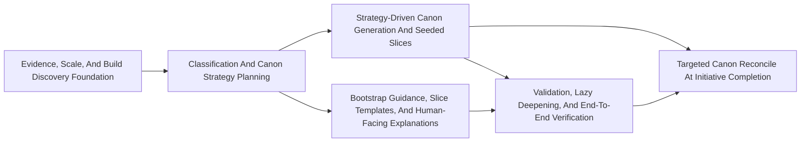

# Approach: Repo Adaptability

## Strategy

Treat this as Bootstrap V3 rather than a narrow scan enhancement. The implementation should evolve `scan-repo` into a staged bootstrap workflow that gathers stronger evidence, chooses a canon strategy explicitly, records that plan in `repo.json`, generates canon from that plan, and then validates a small seeded starting point instead of trying to exhaustively document every local surface.

The first priority is better evidence and classification, because Jira showed that the current routing-path heuristics underweight raw repo scale and build-defined structure. Build systems should win over directory heuristics, scale should establish a minimum repo class, and strategy selection should follow the classification instead of being improvised during synthesis.

The implementation should still remain additive. Existing repos should continue to work, `scan-repo` should become the entry point for this richer flow, and `repo.json` should become the durable machine-readable record for scale findings, detected build systems, candidate slices, chosen canon strategy, generated targets, and validation results.

Just as importantly, initiative completion needs a different canon maintenance model by repo scale. `normal-repo` can still afford a broader initiative-end synthesis pass, but `large-repo` and `mega-repo` must switch to targeted canon reconcile: update global orientation docs only when durable repo-wide truth changed, update touched slice packs by default, update neighboring slices only when interfaces or boundaries shifted, and create a new slice only when the initiative proved the current slice is too broad.

## Partitions (Feature Branches)

### Partition 1: Evidence, Scale, And Build Discovery Foundation → `feat/bootstrap-v2-evidence-foundation`
**Modules**: `src/cicadas/scripts/scan_repo.py`, `src/cicadas/scripts/utils.py`, `src/cicadas/scripts/command_registry.py`, `tests`
**Scope**: Upgrade `scan-repo` from a lightweight tree scanner into a stronger evidence collector that computes meaningful file count, estimated LoC, language totals, build/workspace systems, declared modules, test surfaces, runtime/package surfaces, and build-first structural partitions.
**Dependencies**: None

#### Artifact Type
cli

#### How to Run
- start: `python src/cicadas/scripts/cicadas.py scan-repo --help`
- teardown: `N/A`

#### Acceptance Criteria
- [ ] `python src/cicadas/scripts/cicadas.py scan-repo --help` exits `0` and documents the richer bootstrap-oriented scan behavior.
- [ ] Running `python src/cicadas/scripts/cicadas.py scan-repo` in temp repos for Java, Node/TS, Python, and Rust emits evidence that includes scale metrics plus detected build/workspace structure when present.
- [ ] The generated `repo.json` records meaningful file count, estimated LoC, language counts, detected build systems, declared modules, major code zones, routing surfaces, and scan pointers.
- [ ] Scale floors are enforced so size alone can promote a repo to `large-repo` or `mega-repo`, even when directory-shape heuristics are weak.

#### Implementation Steps
1. Expand `scan-repo` evidence gathering to compute meaningful file count, estimated LoC, language counts, top-level fanout, and major structural surfaces while excluding generated, local, ignored, and agentic content by default.
2. Add build-first discovery for Java, Node/TS, Python, and Rust ecosystems, preferring declared build/workspace/module structure over directory-name inference.
3. Record build-defined modules, major code zones, test surfaces, runtime/package surfaces, and related evidence in shared metadata helpers.
4. Add real-filesystem tests that cover build detection, scale evidence, excluded content, and large-repo evidence gathering behavior.

### Partition 2: Classification And Canon Strategy Planning → `feat/bootstrap-v3-classification-planning`
**Modules**: `src/cicadas/scripts/scan_repo.py`, `src/cicadas/scripts/utils.py`, `src/cicadas/emergence/bootstrap.md`, `tests`
**Scope**: Replace the current narrow heuristic with a scale-floor-plus-structure model, make build-defined structure win when present, and write the chosen canon strategy, slice policy, and generation plan into `repo.json`.
**Dependencies**: Requires Partition 1

#### Artifact Type
cli

#### How to Run
- start: `python src/cicadas/scripts/cicadas.py scan-repo --progress on`
- teardown: `N/A`

#### Acceptance Criteria
- [ ] Repo mode follows `max(scale_class, topology_class)` semantics, with scale floors of `<1K/<100K`, `1K+/100K+`, and `25K+/2M+` for normal/large/mega.
- [ ] Build-defined structure can promote a borderline repo but cannot demote a clearly huge repo.
- [ ] `repo.json` records a human-understandable classification explanation plus chosen canon strategy, seeded candidate slices, deferred slices, and classifier uncertainty.
- [ ] User-facing outputs replace or demote confusing terms like `ownership_zone_candidates` and `runtime_paths` in favor of clearer routing language.

#### Implementation Steps
1. Refactor classification into explicit scale signals, structure signals, and final decision rules with scale floors.
2. Introduce clearer user-facing terms such as major code zones, working areas, routing surfaces, declared modules, and runtime/package surfaces.
3. Add explicit canon strategy selection with defaults of flat for normal and locality-first for large/mega.
4. Write the bootstrap plan into `repo.json`, including root docs, seeded slice packs, optional module docs, deferred slices, and validation steps.
5. Update bootstrap guidance and tests so classification and strategy explanations are understandable to human reviewers.

### Partition 3: Strategy-Driven Canon Generation And Seeded Slices → `feat/bootstrap-v3-canon-generation`
**Modules**: `src/cicadas/scripts/synthesize.py`, `src/cicadas/scripts/utils.py`, `src/cicadas/scripts/command_registry.py`, `tests`
**Scope**: Make synthesis consume the richer `repo.json` plan, generate flat canon for small repos and orientation-plus-seeded-slices for large/mega repos, and keep module snapshots optional instead of first-class for larger repos.
**Dependencies**: Requires Partition 2

#### Artifact Type
cli

#### How to Run
- start: `python src/cicadas/scripts/cicadas.py synthesize repo-adaptability --initiative --help`
- teardown: `N/A`

#### Acceptance Criteria
- [ ] `python src/cicadas/scripts/cicadas.py synthesize repo-adaptability --initiative --help` exits `0`.
- [ ] In a temp repo with strategy-rich `repo.json`, synthesis generates the root docs and seeded slice docs selected by the plan.
- [ ] In large/mega scenarios, root canon stays small while detailed canon is placed under the relevant `slices/` subtree.
- [ ] In temp repos without `repo.json`, synthesis triggers adaptive backfill via the richer `scan-repo` path and then continues instead of failing.
- [ ] Existing repos with only flat canon continue to synthesize successfully without manual migration.

#### Implementation Steps
1. Refactor synthesis around explicit generation targets from `repo.json` rather than inferred mode-only behavior.
2. Support root orientation docs, seeded slice packs, and optional module canon where the plan calls for them.
3. Keep `repo-context.md` as the compact structural reload artifact while using `repo-tree.jsonl` for deeper evidence only when needed.
4. Preserve lazy backfill for missing metadata by routing through the upgraded `scan-repo`.
5. Add temp-repo tests for strategy-driven generation, module hierarchy generation, and legacy fallback.

### Partition 4: Bootstrap Guidance, Slice Templates, And Human-Facing Explanations → `feat/bootstrap-v3-guidance-and-templates`
**Modules**: `src/cicadas/emergence/bootstrap.md`, `src/cicadas/templates/synthesis-prompt.md`, `src/cicadas/templates/canon-summary.md`, `src/cicadas/templates/slice-*.md`, `README.md`
**Scope**: Update the human- and agent-facing bootstrap contract so the workflow is framed in V3 terms: evidence gathering, build-first discovery, strategy planning, generation, and validation with clearer language around orientation, slices, and lazy deepening.
**Dependencies**: Requires Partition 2

#### Artifact Type
library

#### How to Run
- teardown: `N/A`

#### Acceptance Criteria
- [ ] `src/cicadas/emergence/bootstrap.md` describes the V2 staged workflow, supported build systems for MVP, scale floors, and canon strategy selection.
- [ ] Templates and prompts use clearer user-facing terms like major code zones, slices, neighboring slices, and declared modules.
- [ ] Guidance explains that the first large/mega orientation docs should be hand-edited for history and "why" context.
- [ ] Documentation explains why a repo was classified a certain way and why a given canon strategy was chosen.

#### Implementation Steps
1. Update bootstrap guidance to describe evidence gathering, build-first discovery, scale floors, strategy planning, generation, and QA.
2. Refresh templates and prompts so slice-oriented canon behavior is explained in human-understandable language.
3. Add slice templates for the minimum MVP pack and explain lazy deepening at initiative/tweak/bug start.
4. Refresh README and related docs to explain the new scan/classify/plan/generate/validate flow.

### Partition 5: Validation, Lazy Deepening, And End-To-End Verification → `feat/bootstrap-v3-validation`
**Modules**: `src/cicadas/scripts/utils.py`, `src/cicadas/README.md`, `tests`, `.cicadas/canon`
**Scope**: Finish the V3 workflow with validation that canon matches the selected strategy and build evidence, plus clear hooks for deepening seeded slices when real work starts.
**Dependencies**: Requires Partition 3 and Partition 4

#### Artifact Type
library

#### How to Run
- teardown: `N/A`

#### Acceptance Criteria
- [ ] Validation checks confirm generated docs exist where the selected strategy said they would and that seeded slices map to real code paths.
- [ ] Obvious slice gaps, broken links, or omitted neighboring-slice references are corrected automatically when cheap to do so, or surfaced in validation results when not.
- [ ] A new integration-style test suite covers fresh bootstrap, build-defined mega-repo planning, seeded slice output, and legacy backfill.
- [ ] Completion output summarizes scale findings, detected build/workspace structure, chosen repo mode, chosen canon strategy, generated artifacts, deferred areas, and uncertainty.

#### Implementation Steps
1. Add validation helpers that compare generated canon against selected targets and gathered structural evidence.
2. Implement best-effort autocorrection for cheap fixes such as missing planned docs, invalid links, or missing obvious references to neighboring slices.
3. Add end-to-end tests for normal, large, and mega repo scenarios, especially build-defined monorepos.
4. Finalize completion summaries and compatibility behavior so older repos still self-heal through the evolved `scan-repo` path.

### Partition 6: Targeted Canon Reconcile At Initiative Completion → `feat/bootstrap-v3-targeted-reconcile`
**Modules**: `src/cicadas/scripts/synthesize.py`, `src/cicadas/scripts/utils.py`, `src/cicadas/templates/synthesis-prompt.md`, `src/cicadas/SKILL.md`, `tests`
**Scope**: Add a repo-mode-aware initiative completion path that keeps full initiative-end synthesis for `normal-repo` but uses targeted canon reconcile for `large-repo` and `mega-repo`, updating touched slices and only the smallest set of global docs that actually changed.
**Dependencies**: Requires Partition 3 and Partition 5

#### Artifact Type
cli

#### How to Run
- start: `python src/cicadas/scripts/cicadas.py synthesize repo-adaptability --initiative`
- teardown: `N/A`

#### Acceptance Criteria
- [ ] `normal-repo` initiative completion still supports broad canon synthesis without requiring slice metadata.
- [ ] `large-repo` and `mega-repo` initiative completion computes a touched-canon scope from changed paths, active specs, and known slice metadata instead of rewriting the whole canon set.
- [ ] Global docs like `product-overview.md`, `tech-overview.md`, and `summary.md` are updated only when the initiative changed durable repo-wide truth.
- [ ] Touched slice packs are updated by default, neighboring slices are pulled in only when interfaces or boundaries changed, and new slices are created only when the existing slice proved too broad.
- [ ] Tests cover normal-repo full synthesis, large-repo targeted slice reconcile, and a boundary-shift case that requires one neighboring slice update.

#### Implementation Steps
1. Define a touched-canon scope model in metadata/helpers that maps changed paths and spec-declared modules to existing slices or module docs.
2. Teach synthesis and its prompt contract to distinguish full synthesis from targeted reconcile based on `repo_mode`.
3. Add heuristics for when global orientation docs should be reconsidered, versus when only slice docs should be refreshed.
4. Add neighboring-slice expansion rules for interface, boundary, and invariant changes while keeping the default reconcile scope small.
5. Update lifecycle guidance so initiative completion explicitly uses targeted reconcile for `large-repo` and `mega-repo`.
6. Add real-filesystem tests for scoped initiative completion behavior across repo modes.

## Sequencing

Partition 1 is the hard prerequisite because it upgrades the evidence model and build detection that all later decisions depend on. Partition 2 must follow immediately because it converts that evidence into explicit repo classification and canon strategy. Once that planning contract exists, Partitions 3 and 4 can proceed in parallel: one implements strategy-driven generation and seeded slice outputs, while the other updates bootstrap/template guidance and human explanations. Partition 5 is the integration and QA sweep that validates the whole staged bootstrap workflow and adds best-effort correction before completion. Partition 6 then builds on those foundations to make initiative completion scale-aware: broad synthesis for normal repos, targeted reconcile for large and mega repos.



### Partitions DAG

```yaml partitions
- name: feat/bootstrap-v2-evidence-foundation
  modules: [src/cicadas/scripts/scan_repo.py, src/cicadas/scripts/utils.py, src/cicadas/scripts/command_registry.py, tests]
  depends_on: []

- name: feat/bootstrap-v2-classification-planning
  modules: [src/cicadas/scripts/scan_repo.py, src/cicadas/scripts/utils.py, src/cicadas/emergence/bootstrap.md, tests]
  depends_on: [feat/bootstrap-v2-evidence-foundation]

- name: feat/bootstrap-v2-canon-generation
  modules: [src/cicadas/scripts/synthesize.py, src/cicadas/scripts/utils.py, src/cicadas/templates, tests]
  depends_on: [feat/bootstrap-v2-classification-planning]

- name: feat/bootstrap-v2-guidance-and-templates
  modules: [src/cicadas/emergence/bootstrap.md, src/cicadas/templates, README.md]
  depends_on: [feat/bootstrap-v2-classification-planning]

- name: feat/bootstrap-v2-qa-and-validation
  modules: [src/cicadas/scripts/utils.py, src/cicadas/README.md, tests, .cicadas/canon]
  depends_on: [feat/bootstrap-v2-canon-generation, feat/bootstrap-v2-guidance-and-templates]

- name: feat/bootstrap-v3-targeted-reconcile
  modules: [src/cicadas/scripts/synthesize.py, src/cicadas/scripts/utils.py, src/cicadas/templates/synthesis-prompt.md, src/cicadas/SKILL.md, tests]
  depends_on: [feat/bootstrap-v3-canon-generation, feat/bootstrap-v3-validation]
```

## Migrations & Compat

This initiative remains additive and lazy-migrating. Existing repos without `repo.json` should continue to function, but the first workflow that needs classification or synthesis should opportunistically create or refresh `repo.json`, `repo-tree.jsonl`, and `repo-context.md` through the evolved `scan-repo` path. Flat top-level canon remains supported, while large and mega repos gain seeded local slice canon only when the recorded strategy calls for it.

Compat rules:
- Never require a manual migration step before synthesis can run.
- Treat missing adaptive files as recoverable by scan/backfill, not as fatal corruption.
- Treat invalid adaptive files as recoverable where cheap to fix and explicit errors only when repair would be misleading.
- Prefer `repo-context.md` for prompt-efficient reloads and use `repo-tree.jsonl` only when deeper structural inspection is necessary.
- Allow repos to override default inclusion/exclusion behavior when the implicit meaningful-file rules are wrong for that codebase.

## Risks & Mitigations

| Risk | Mitigation |
|------|------------|
| Build-system discovery is too shallow to improve large-repo classification | Prioritize Java, Node/TS, Python, and Rust in the first pass, and make build-defined structure the dominant signal when detected. |
| Size floors and structure promotion drift apart into unclear behavior | Encode scale class, topology class, and final repo mode separately in `repo.json`, then test the `max(scale_class, topology_class)` rule directly. |
| Hierarchical canon produces too much output for mega repos | Keep root canon small, make module canon selective, and let the plan defer low-value areas explicitly. |
| QA becomes expensive or brittle on large repos | Use best-effort checks and cheap autocorrection first, then emit structured validation results for anything ambiguous. |
| Legacy repos regress because adaptive metadata is missing | Route missing-metadata recovery through the evolved `scan-repo` path and keep flat canon consumers working. |

## Alternatives Considered

One alternative was a single broad feature branch that changed scripts, templates, bootstrap guidance, and tests together. That was rejected because it would make the schema and filename contract too unstable while implementation was in progress, and it would be difficult to review compatibility risk. Another alternative was to put templates before the scan contract, but that would encourage placeholder assumptions about artifact names and heuristic structure. A third alternative was to include graph-like navigation work in this initiative; that was rejected because the current goal is adaptive canon with a clean graph seam, not speculative dependency infrastructure.
