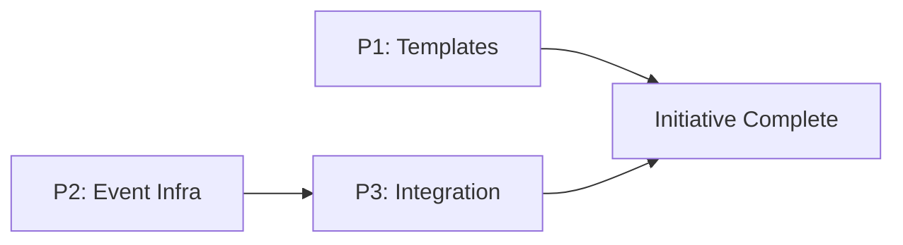

# Approach: Partition Acceptance

## Strategy

Three partitions: two parallel (templates, event infrastructure), one sequential (integration — depends on the event infrastructure being built). P1 and P2 touch entirely different files and can run in isolated worktrees simultaneously. P3 wires everything together and updates documentation.

## Partitions (Feature Branches)

### Partition 1: Templates → `feat/partition-spec-templates`
**Modules**: `src/cicadas/templates`, `src/cicadas/emergence`
**Scope**: Add `#### Acceptance Criteria`, `#### Artifact Type`, and `#### How to Run` subsections to each partition block in `approach.md` template. Update `emergence/approach.md` to instruct the agent to generate these subsections: infer artifact type, generate falsifiable AC by artifact type, generate How to Run from detected build tooling, flag untestable items.
**Dependencies**: None

#### Artifact Type
library

#### How to Run
- start: _(N/A — static Markdown files)_
- ready-check: _(N/A)_
- teardown: _(N/A)_

#### Acceptance Criteria
- [ ] `src/cicadas/templates/approach.md` contains `#### Artifact Type`, `#### How to Run`, and `#### Acceptance Criteria` subsections inside each example partition block
- [ ] `#### Artifact Type` enumerates valid values: `web-ui | rest-api | cli | library | background-service | full-stack`
- [ ] `#### How to Run` includes `start`, `ready-check`, and `teardown` fields with a note that `start` may be omitted for libraries/CLIs
- [ ] `#### Acceptance Criteria` uses checkbox format with a `<!-- NEEDS MANUAL REVIEW -->` example item
- [ ] `src/cicadas/emergence/approach.md` instructs the agent to infer artifact type from partition description and ask when ambiguous
- [ ] `src/cicadas/emergence/approach.md` instructs the agent to generate AC matched to the artifact type (API criteria for `rest-api`, interaction criteria for `web-ui`, stdout/exit criteria for `cli`)
- [ ] `src/cicadas/emergence/approach.md` instructs the agent to generate `#### How to Run` by detecting `package.json`, `pyproject.toml`, `Makefile`, or `Dockerfile`
- [ ] `src/cicadas/emergence/approach.md` instructs the agent to flag untestable criteria with `<!-- NEEDS MANUAL REVIEW -->`
- [ ] The `yaml partitions` fenced block in `approach.md` template is unchanged

#### Implementation Steps
1. Edit `src/cicadas/templates/approach.md`: add the three new subsections to each example partition block (before `#### Implementation Steps`)
2. Edit `src/cicadas/emergence/approach.md`: add a new step in the Plan section for generating the three subsections per partition

---

### Partition 2: Event Log Infrastructure → `feat/event-log-infrastructure`
**Modules**: `src/cicadas/scripts`, `tests`
**Scope**: Create `emit_event.py` (write events with `flock`) and `get_events.py` (read/filter event stream). Write tests. No wiring into existing scripts yet — that's P3.
**Dependencies**: None

#### Artifact Type
library

#### How to Run
```
PYTHONPATH=src/cicadas/scripts:tests python3 -m unittest tests.test_emit_event tests.test_get_events
```
- start: _(N/A — library scripts, no server)_
- ready-check: _(N/A)_
- teardown: _(N/A)_

#### Acceptance Criteria
- [ ] `src/cicadas/scripts/emit_event.py` exists and appends a valid JSON line to `.cicadas/active/{initiative}/events.jsonl` when called
- [ ] Each emitted event contains `timestamp`, `type`, `initiative`, `branch`, and `data` fields
- [ ] `emit_event.py` creates `events.jsonl` (and parent directory) if absent
- [ ] `emit_event.py` uses `fcntl.flock(LOCK_EX)` before writing and releases after
- [ ] Two concurrent `emit_event.py` calls produce two valid, non-interleaved JSONL lines
- [ ] `src/cicadas/scripts/get_events.py` exists and outputs JSONL to stdout
- [ ] `get_events.py --initiative foo` returns all events for the initiative, sorted by timestamp
- [ ] `get_events.py --type partition.complete` filters to matching event types (exact and prefix match)
- [ ] `get_events.py --since {ISO}` filters to events after the given timestamp
- [ ] `get_events.py --last N` returns the N most recent events
- [ ] `get_events.py` returns empty output (exit 0) when `events.jsonl` does not exist
- [ ] `emit_event.py` validates `--initiative` against `[a-z0-9-]+` and rejects invalid values
- [ ] Tests use real temp filesystem (no mocks for file I/O); concurrent write test uses `threading`

#### Implementation Steps
1. Create `src/cicadas/scripts/emit_event.py`
2. Create `src/cicadas/scripts/get_events.py`
3. Create `tests/test_emit_event.py`
4. Create `tests/test_get_events.py`

---

### Partition 3: Event Integration & Documentation → `feat/event-integration`
**Modules**: `src/cicadas/scripts/kickoff.py`, `src/cicadas/scripts/branch.py`, `src/cicadas/scripts/archive.py`, `src/cicadas/scripts/open_pr.py`, `src/cicadas/scripts/status.py`, `src/cicadas/implementation.md`, `src/cicadas/SKILL.md`
**Scope**: Wire `emit_event.py` into each lifecycle script at its natural completion point. Update `status.py` to surface the last 5 events per initiative. Update `implementation.md` with task/partition completion rules. Update `SKILL.md` to document the event log in the Operations section.
**Dependencies**: `feat/event-log-infrastructure`

#### Artifact Type
library

#### How to Run
```
PYTHONPATH=src/cicadas/scripts:tests python3 -m unittest discover -s tests/
```
- start: _(N/A)_
- ready-check: _(N/A)_
- teardown: _(N/A)_

#### Acceptance Criteria
- [ ] `kickoff.py` emits `initiative.kicked_off` (with `intent`, `owner`) after successful registration
- [ ] `branch.py` emits `branch.created` (with `modules`, `intent`, `initiative`) after registration
- [ ] `branch.py` emits `worktree.created` (with `worktree_path`) when a worktree is created
- [ ] `archive.py` emits `specs.archived` (with `archive_path`, `archive_type`) after archiving
- [ ] `open_pr.py` emits `pr.opened` (with `base_branch`, `platform`, `url`) on success
- [ ] `open_pr.py` emits `pr.blocked` (with `base_branch`, `verdict`) when review blocks the PR
- [ ] All script-level event emissions use `check=False` so a failed emit never aborts the primary operation
- [ ] `status.py` displays the last 5 events (timestamp, type, brief data) for each active initiative
- [ ] `status.py` handles missing `events.jsonl` gracefully (no error, no output for that initiative)
- [ ] `src/cicadas/implementation.md` contains a rule directing the coding agent to call `emit_event.py --type task.complete` after each task checkbox is marked
- [ ] `src/cicadas/implementation.md` specifies the `partition.complete` event payload schema (`summary`, `canon_entry`, `notes_for_evaluator`)
- [ ] `src/cicadas/SKILL.md` documents the event log, `get_events` interface, and `task.complete`/`partition.complete` event types in the Operations section
- [ ] Full test suite passes (`python3 -m unittest discover -s tests/`)
- [ ] Existing test assertions updated where script output changed due to event emission

#### Implementation Steps
1. Edit `kickoff.py`: add `emit_event` call after registration block
2. Edit `branch.py`: add `emit_event` calls after registration and worktree creation
3. Edit `archive.py`: add `emit_event` call after archive move
4. Edit `open_pr.py`: add `emit_event` calls for opened and blocked cases
5. Edit `status.py`: call `get_events --last 5` per initiative and append to output
6. Edit `implementation.md`: add Rules 9 and 10 for task/partition event emission
7. Edit `SKILL.md`: add Event Log subsection to Operations

## Sequencing

P1 and P2 are independent and run in parallel. P3 depends on P2 (needs `emit_event.py` to exist).



### Partitions DAG

```yaml partitions
- name: feat/partition-spec-templates
  modules: [src/cicadas/templates, src/cicadas/emergence]
  depends_on: []

- name: feat/event-log-infrastructure
  modules: [src/cicadas/scripts/emit_event.py, src/cicadas/scripts/get_events.py, tests]
  depends_on: []

- name: feat/event-integration
  modules: [src/cicadas/scripts/kickoff.py, src/cicadas/scripts/branch.py, src/cicadas/scripts/archive.py, src/cicadas/scripts/open_pr.py, src/cicadas/scripts/status.py, src/cicadas/implementation.md, src/cicadas/SKILL.md]
  depends_on: [feat/event-log-infrastructure]
```

## Migrations & Compat

Existing initiatives without `events.jsonl` are handled gracefully by both `get_events.py` (empty output) and `status.py` (no events section). No migration required.

## Risks & Mitigations

| Risk | Mitigation |
|------|------------|
| Existing test assertions break from script output changes | Update affected assertions in P3; run full suite before merging |
| `emit_event` subprocess call uses wrong Python interpreter | Use `sys.executable` in all script-level invocations |

## Alternatives Considered

**Per-branch event files**: Each worktree writes its own `events-{branch}.jsonl`; observers merge. Rejected — single file with `flock` is simpler, `get_events` abstraction makes it a two-way door if scale demands it later.

**Signal board extension**: Partition completion as a structured signal in `registry.json`. Rejected — signals are peer-to-peer coordination messages, not lifecycle events; mixing the two concerns would require parsing free-text signals or adding signal types to the registry schema.
