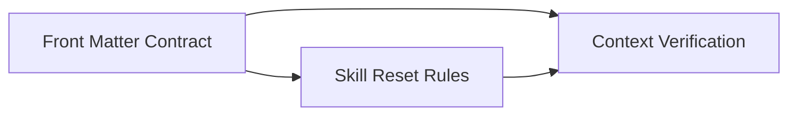

# Approach: context-optimization

## Strategy

Use a staged approach with a shared schema first, then apply it consistently to templates and workflow instructions. The initiative should avoid introducing new persistent orchestration files; instead it should embed context metadata inside existing specs and explicitly reuse `canon/summary.md` for shared branch-start context. Work can split between template edits and instruction updates once the schema is stable.

## Partitions (Feature Branches)

### Partition 1: Front Matter Contract → `feat/frontmatter-contract`
**Modules**: `src/cicadas/templates/prd.md`, `src/cicadas/templates/ux.md`, `src/cicadas/templates/tech-design.md`, `src/cicadas/templates/approach.md`, `src/cicadas/templates/tasks.md`
**Scope**: Define and apply a consistent front matter schema and section-index pattern across the core initiative templates.
**Dependencies**: None

#### Artifact Type
library

#### How to Run
- start: `N/A`
- teardown: `N/A`

#### Acceptance Criteria
- [ ] Each core template includes the same machine-readable front matter keys for summary, load hints, dependencies, modules, and index.
- [ ] Section indexes point to semantic headings rather than brittle line-number references.
- [ ] Template wording keeps summaries compact enough to serve as low-cost reload artifacts.

#### Implementation Steps
1. Define the shared schema and required keys.
2. Update each core template to include the schema with phase-appropriate index entries.
3. Verify the resulting templates are internally consistent and readable.

### Partition 2: Skill Reset Rules → `feat/skill-reset-rules`
**Modules**: `src/cicadas/SKILL.md`
**Scope**: Teach Cicadas to create, refresh, and consume front matter and to apply branch-start, post-spec, and post-partition reset rules.
**Dependencies**: Requires Partition 1

#### Artifact Type
library

#### How to Run
- start: `N/A`
- teardown: `N/A`

#### Acceptance Criteria
- [ ] The skill tells agents to create and refresh front matter during emergence and Reflect.
- [ ] The skill defines reset behavior as a trust-and-reload boundary, not guaranteed memory deletion.
- [ ] The skill tells the host to clear or compact context at reset boundaries when that capability exists.
- [ ] Branch-start guidance prefers `canon/summary.md`, front matter, and partition-scoped sections before full-doc loading.

#### Implementation Steps
1. Add front matter authoring/consumption guidance to the skill.
2. Add explicit Branch Reset, Phase Reset, and Partition Reset rules, each with an opportunistic clear/compact hint.
3. Clarify escalation rules for when the agent may open broader context.

### Partition 3: Canon Summary and Verification → `feat/context-verification`
**Modules**: `src/cicadas/templates/canon-summary.md`, `tests/`
**Scope**: Refine shared compact-context guidance and verify the new template/instruction contract.
**Dependencies**: Requires Partition 1, Requires Partition 2

#### Artifact Type
library

#### How to Run
- start: `pytest`
- teardown: `N/A`

#### Acceptance Criteria
- [ ] `canon/summary.md` remains the shared compact context artifact and is not displaced by a new trace file.
- [ ] Tests or verification steps cover the presence and expected shape of the new metadata or helpers.
- [ ] Documentation and verification confirm backward-compatible behavior when older specs lack front matter.

#### Implementation Steps
1. Decide whether `canon-summary.md` needs a minimal active-spec routing note.
2. Add or update tests that validate the template contract and any helper logic.
3. Run verification and document any follow-up gaps.

## Sequencing

Partition 1 establishes the contract. Partition 2 depends on that contract so the skill language reflects the exact schema. Partition 3 follows both so verification and any `canon-summary.md` refinement validate the final shape.



### Partitions DAG

```yaml partitions
- name: feat/frontmatter-contract
  modules: [src/cicadas/templates/prd.md, src/cicadas/templates/ux.md, src/cicadas/templates/tech-design.md, src/cicadas/templates/approach.md, src/cicadas/templates/tasks.md]
  depends_on: []

- name: feat/skill-reset-rules
  modules: [src/cicadas/SKILL.md]
  depends_on: [feat/frontmatter-contract]

- name: feat/context-verification
  modules: [src/cicadas/templates/canon-summary.md, tests]
  depends_on: [feat/frontmatter-contract, feat/skill-reset-rules]
```

## Migrations & Compat

This is an additive documentation and instruction change. Existing archived or active specs without front matter should still be readable. The method should specify a fallback to heading-based/manual reading when front matter is absent, with front matter becoming the default for newly drafted work.

## Risks & Mitigations
| Risk | Mitigation |
|------|------------|
| Front matter schema becomes too verbose | Keep required keys small and summaries intentionally compact |
| Skill wording implies stronger memory control than the host provides | Explicitly describe reset rules as re-anchoring behavior, ask for clear/compact only opportunistically, and keep file-backed reload authoritative |
| Another file slips in as a context manifest | Keep shared compact context in `canon/summary.md` and semantic routing in the specs themselves |

## Alternatives Considered

- **Standalone context file per initiative** — Rejected because Cicadas already has enough coordination artifacts, and the user preference is to reuse existing file mechanisms.
- **Store semantic indexes in `emergence-config.json`** — Rejected because it mixes operational state with semantic content routing.
- **Line-number pointers in metadata** — Rejected because they drift rapidly during Reflect and make the system brittle.
