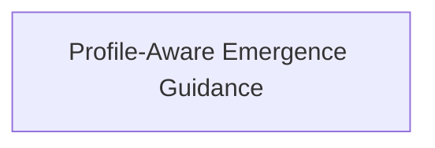

# Approach: Technical Initiative Profiles

## Strategy

Use a single feature branch because this is a tightly coupled guidance/template change. Implement templates first, then start-flow and downstream guidance, then tests. No runtime CLI behavior or canonical docs are changed on the feature branch.

## Partitions (Feature Branches)

### Partition 1: Profile-Aware Emergence Guidance → `feat/initiative-profile-guidance`
**Modules**: `src/cicadas/emergence`, `src/cicadas/templates`, `tests/test_templates.py`
**Scope**: Add initiative profile guidance, Technical Brief and Operator Experience templates, and regression tests.
**Dependencies**: None

#### Artifact Type
library

#### How to Run
- start: N/A
- ready-check: `uv run pytest tests/test_templates.py`
- teardown: N/A

#### Acceptance Criteria
- [ ] `start-flow.md` asks for initiative profile after name and before requirements source.
- [ ] `emergence-config.json` guidance records `initiative_profile` without overwriting other keys.
- [ ] Technical profile guidance uses `technical-brief.md` and optional `operator-experience.md`.
- [ ] Product profile guidance preserves the full PRD and UX path.
- [ ] Tech Design, Approach, and Tasks guidance can ingest profile-appropriate artifacts.
- [ ] New templates include front matter contract keys.
- [ ] Template tests pass.

#### Implementation Steps
1. Add `technical-brief.md` and `operator-experience.md` templates.
2. Update start-flow sequence and profile storage rules.
3. Update clarify and UX module branching guidance.
4. Update tech-design, approach, and tasks ingest guidance.
5. Add template tests for front matter and profile guidance.
6. Run targeted tests and reflect task completion.

## Sequencing

Single partition, sequential within the branch.



### Partitions DAG

```yaml partitions
- name: feat/initiative-profile-guidance
  modules: [src/cicadas/emergence, src/cicadas/templates, tests/test_templates.py]
  depends_on: []
```

## Migrations & Compat

No migration is required. Existing drafts without `initiative_profile` remain product/full-flow by default.

## Risks & Mitigations

| Risk | Mitigation |
|------|------------|
| Reduced ceremony weakens implementation context | Keep Tech Design, Approach, and Tasks mandatory; require Technical Brief contents. |
| Agents skip UX too broadly | Require Operator Experience for CLI/output/log/error/docs/agent-instruction impact and explicit skip rationale otherwise. |
| Product flow changes accidentally | Tests assert product/full-flow guidance remains documented. |

## Alternatives Considered

- **CLI enforcement now**: Deferred because this initiative is about methodology guidance and templates; deterministic validation can follow once workflow semantics settle.
- **PRD-lite only**: Rejected because mostly technical work needs a different artifact shape, not merely a shorter product PRD.
