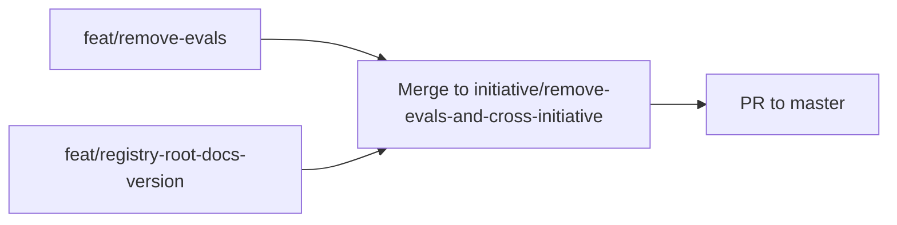

# Approach: remove-evals-and-cross-initiative

## Strategy

Parallel deletion. Two independent feature branches that can be implemented simultaneously — one touching only markdown/docs, the other touching only Python scripts, tests, and project-level docs. Merge both into the initiative branch, then merge the initiative branch to master via a single PR. No phasing, no migration, no backward-compat shims.

## Partitions (Feature Branches)

### Partition 1: Remove Evals → `feat/remove-evals`

**Modules**: `src/cicadas/emergence/`, `src/cicadas/templates/eval-spec.md`, `src/cicadas/SKILL.md`

**Scope**: Delete `emergence/eval-spec.md` and `templates/eval-spec.md`. Remove all LLMs-and-evals content (step 3 in start-flow, evals steps in clarify/tweak/bug-fix/approach, evals section in SKILL.md). No Python changes.

**Dependencies**: None

#### Artifact Type

library

#### How to Run

_(No persistent process — library/docs only.)_

#### Acceptance Criteria

- [ ] `grep -rn "eval_status\|building_on_ai\|eval.spec\|eval-spec\|LLMs and Evals" src/cicadas/emergence/ src/cicadas/SKILL.md` returns zero results
- [ ] `src/cicadas/emergence/eval-spec.md` does not exist
- [ ] `src/cicadas/templates/eval-spec.md` does not exist
- [ ] `src/cicadas/emergence/start-flow.md` has no step 3 — the mandatory sequence goes directly from "Create draft folder" to the next step (Requirements source / Publish destination / PR preference); steps are correctly renumbered
- [ ] `src/cicadas/emergence/start-flow.md` scoping table has no "LLMs and Evals?" row
- [ ] `src/cicadas/emergence/approach.md` has no eval-spec offer or eval placement question
- [ ] `src/cicadas/SKILL.md` has no "LLMs and Evals" heading or sub-section

#### Implementation Steps

1. Delete `src/cicadas/emergence/eval-spec.md`
2. Delete `src/cicadas/templates/eval-spec.md`
3. Edit `src/cicadas/emergence/start-flow.md` — remove step 3 body; renumber old steps 4–7 to 3–6; update the "Mandatory sequence" narrative, scoping table (remove "LLMs and Evals?" row), and type-description paragraphs at the bottom
4. Edit `src/cicadas/emergence/clarify.md` — update step 0 start-flow summary (remove "LLMs and Evals?" from the name list)
5. Edit `src/cicadas/emergence/tweak.md` — remove step 0d and the "LLM and Eval reminder" block
6. Edit `src/cicadas/emergence/bug-fix.md` — remove step 0d and the "LLM and Eval reminder" block
7. Edit `src/cicadas/emergence/approach.md` — remove step 3 (eval-spec offer + eval placement + `eval_placement` write)
8. Edit `src/cicadas/SKILL.md` — remove the "LLMs and Evals" sub-section under Emergence; update the Emergence process table row and start-flow description to remove evals mentions; remove `get_registry_root` / worktree-routing documentation
9. Run grep gate: `grep -rn "eval_status\|building_on_ai\|eval.spec\|eval-spec\|get_registry_root" src/cicadas/` → must return zero hits

---

### Partition 2: Remove Registry Root + Docs + Version → `feat/registry-root-docs-version`

**Modules**: `src/cicadas/scripts/utils.py`, `src/cicadas/scripts/emit_event.py`, `tests/test_utils.py`, `README.md`, `agents.md`, `docs/`, `pyproject.toml`, `release-notes.md`

**Scope**: Remove `get_registry_root()` from `utils.py`; simplify `get_registry_dir()`; fix `emit_event.py`; trim two test cases; scrub project docs of evals/cross-initiative registry mentions; bump to v1.0.0.

**Dependencies**: None

#### Artifact Type

library

#### How to Run

```bash
PYTHONPATH=src/cicadas/scripts:tests python3 -m unittest discover -s tests/
```

#### Acceptance Criteria

- [ ] `grep -rn "get_registry_root" src/` returns zero results
- [ ] `get_registry_dir()` in `utils.py` is a one-liner: `return get_project_root() / ".cicadas"`
- [ ] `grep "get_registry_root" src/cicadas/scripts/emit_event.py` returns zero results
- [ ] `grep "get_registry_root" tests/` returns zero results
- [ ] Full test suite passes: `PYTHONPATH=src/cicadas/scripts:tests python3 -m unittest discover -s tests/`
- [ ] `grep "^version" pyproject.toml` returns `version = "1.0.0"`
- [ ] `release-notes.md` contains a `## v1.0.0` section
- [ ] `grep -n "eval_status\|building_on_ai\|eval.spec\|get_registry_root\|Building on AI" README.md agents.md docs/cicadas-method-general.md` returns zero results

#### Implementation Steps

1. Edit `src/cicadas/scripts/utils.py` — delete `get_registry_root()` function (lines 22–49); change `get_registry_dir()` body to `return get_project_root() / ".cicadas"` (remove docstring referencing primary worktree)
2. Edit `src/cicadas/scripts/emit_event.py` — change import: `from utils import get_registry_root, load_config` → `from utils import get_registry_dir, load_config`; change path: `get_registry_root() / ".cicadas" / "active"` → `get_registry_dir() / "active"`
3. Edit `tests/test_utils.py` — rename class `TestGetRegistryRoot` → `TestGetRegistryDir`; delete `test_primary_worktree_returns_self` and `test_linked_worktree_returns_primary`; keep `test_get_registry_dir_returns_cicadas_subdir`
4. Run test suite — all must pass
5. Edit `agents.md` — remove "Building on AI — gate and eval status in start flow, optional eval spec for initiatives, eval/benchmark reminder for tweaks/bugs" from the `src/cicadas/` bullet
6. Edit `docs/cicadas-method-general.md` — remove `Building on AI? and eval status` from the emergence-config.json comment (~line 116); remove the sentence starting "The standard start flow also records Building on AI?" (~line 162); remove gap table row X1 (~line 502) and the cross-initiative future-vision paragraph (~line 533)
7. Edit `README.md` — grep for evals and cross-initiative registry mentions; remove any found
8. Edit `pyproject.toml` — `version = "0.3.1"` → `version = "1.0.0"`
9. Edit `release-notes.md` — prepend `## v1.0.0` section documenting: removal of evals question chain, removal of `get_registry_root()` cross-worktree routing, doc cleanup

## Sequencing

Both partitions are fully independent and can run in parallel.



### Partitions DAG

> This block is machine-readable. It drives automatic worktree creation in `branch.py`.

```yaml partitions
- name: feat/remove-evals
  modules: [src/cicadas/emergence/, src/cicadas/templates/eval-spec.md, src/cicadas/SKILL.md]
  depends_on: []

- name: feat/registry-root-docs-version
  modules: [src/cicadas/scripts/utils.py, src/cicadas/scripts/emit_event.py, tests/test_utils.py, README.md, agents.md, docs/, pyproject.toml, release-notes.md]
  depends_on: []
```

## Migrations & Compat

No data migration needed. Existing `emergence-config.json` files with `building_on_ai`/`eval_status` keys are silently inert — those fields are never read by Python scripts, only by the (now-removed) emergence prompts.

The removal of `get_registry_root()` is a **breaking Python API change** — hence the major version bump to 1.0.0. No consumers outside this repo are known.

## Risks & Mitigations

| Risk | Mitigation |
|---|---|
| Missed evals reference in an emergence file | Grep gate in Partition 1 acceptance criteria catches it |
| `emit_event.py` path regression | Test suite covers `emit_event` → `get_events` round-trip; AC includes test-suite pass |
| Orphaned `get_registry_root` call in a script not checked | `grep -rn "get_registry_root" src/` AC in Partition 2 catches any stray callers |

## Alternatives Considered

**Single partition**: Could combine both clusters into one feature branch. Rejected because the clusters touch entirely different file sets; keeping them separate makes review simpler and allows parallel execution.

**Keep `get_registry_root()` as deprecated no-op**: Could leave the function in place returning `get_project_root()` to avoid a breaking change. Rejected — the function's name implies behavior that no longer exists, which is more confusing than removing it cleanly with a major version bump.
