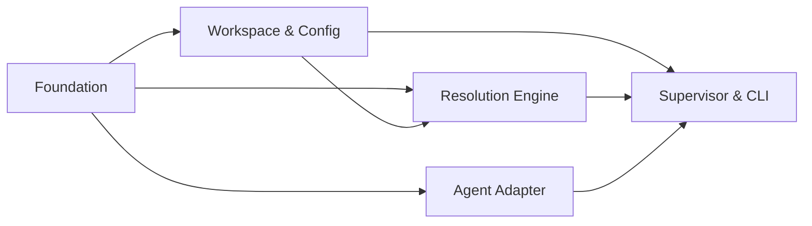

# Approach: cicadas-chorus

## Strategy

`cicadas-chorus` is a greenfield Python package with no existing users or deployed state. The strategy is **parallel foundation + sequential integration**: build independent infrastructure modules in parallel, then assemble them into the supervisor loop last.

The implementation splits into five partitions:

1. **Foundation** — data models, logging, base interfaces, package scaffolding. Pure Python, no I/O, no LLM calls. Unblocks every other partition.
2. **Workspace & Config** — filesystem readers, config loading, prompt loading, eval/token logging. Depends on Foundation; can start immediately after it merges.
3. **Resolution Engine** — classifier, party mode, escalation transport. The core supervisor intelligence. Depends on Foundation and Workspace & Config.
4. **Agent Adapter** — `ClaudeCodeAdapter` + plugin system. SDK wiring isolated from core logic. Depends on Foundation only; runs in parallel with Workspace & Config and Resolution Engine.
5. **Supervisor & CLI** — supervisor loop, CLI entry point, SKILL.md update. Integration layer; built last.

Partitions 2, 3, and 4 can be developed concurrently once Partition 1 merges. Partition 5 is the integration point and waits for all four.

No migrations, no brownfield concerns, no backward compatibility constraints — net-new package.

---

## Partitions (Feature Branches)

### Partition 1: Foundation → `feat/chorus-foundation`

**Modules**: `chorus/models`, `chorus/log_config`, `chorus/agents/base`, `pyproject.toml`, `tests/base`

**Scope**: All dataclasses, the shared logger, the `CodingAgentInterface` and `EscalationTransport` ABCs, and the package scaffold. No LLM calls, no filesystem I/O, no external deps. Everything else imports from here.

**Dependencies**: None

#### Implementation Steps
1. Scaffold `cicadas-chorus/` repo: `pyproject.toml` (entry point `chorus = chorus.cli:main`, deps `litellm>=1.0`, `claude_agent_sdk>=0.1`), `src/chorus/__init__.py`, `tests/__init__.py`
2. Create `log_config.py`: `LOGGER_NAME`, `LOG_FORMAT`, `create_logger(level, log_file)` with stdout + optional rotating file handler
3. Create `models.py`: `TokenUsage`, `Interrupt`, `AgentResult`, `Decision`, `Session`, `AuthorityRule`, `AuthorityPolicy`, `PartyOutputs`, `EvalSample` dataclasses
4. Create `agents/base.py`: `CodingAgentInterface` ABC (`run`, `resume`), `EscalationTransport` ABC (`send`), `PermissionDecision` types
5. Create `tests/base.py`: `CicadasChorusTest` with temp workspace, minimal `.cicadas/` structure, `init_git()` helper
6. Write `tests/test_models.py`: serialisation round-trips, field defaults, `EvalSample.label` is None at construction

---

### Partition 2: Workspace & Config → `feat/chorus-workspace-config`

**Modules**: `chorus/context`, `chorus/authority`, `chorus/config`, `chorus/token_log`, `chorus/eval_log`, `chorus/plugins` (registry only), `prompts/`

**Scope**: Everything that reads the workspace or loads configuration — no LLM calls, no agent SDK. Includes all prompt TOML files (content can be placeholder stubs at this stage; finalised in Partition 3).

**Dependencies**: Partition 1 (`feat/chorus-foundation`)

#### Implementation Steps
1. Create `token_log.py`: `init_log`, `append_entry`, `load_log` — mirrors Cicadas `tokens.py` API; writes to `supervisor/tokens.json`
2. Create `eval_log.py`: `append_sample(path, sample)` JSONL append; best-effort (`OSError` → WARNING, never raises); `--no-eval-log` respected via a module-level enabled flag set at startup
3. Create `context.py`: `supervisor_dir(workspace, initiative)` resolution; spec bundle reader (registry.json, `*.md` specs, `emergence-config.json`, canon summary); `write_handoff(supervisor_dir, intent, decisions, authority_summary, task_focus)` writes `chorus-handoff.md`; spec bundle cached for session lifetime
4. Create `authority.py`: load `authority.md` front-matter + rule list into `AuthorityPolicy`; `evaluate(question) → AuthorityRule | None`; pre-flight gate check
5. Create `config.py` + `ConfigManager`: load/merge global `~/.config/chorus/agents.json` + workspace `.cicadas/agents.json`; `load_agent(name)`, `load_model(id)`, `load_coding_agent(id)`; strip auth fields from log output
6. Create `PromptLoader`: TOML parse, version resolution (`latest` = highest `[vN]`), `{placeholder}` substitution via `render(**kwargs)`
7. Create `plugins.py`: `CicadasPluginRegistry` protocol; `discover_plugins(config)` — `entry_points(group="cicadas.plugins")` + explicit paths merged
8. Create `prompts/` directory with stub TOML files: `classifier.toml`, `reviewer_analyst.toml`, `reviewer_ux.toml`, `reviewer_architect.toml`, `synthesizer.toml`, `consensus.toml`, `intent_synthesizer.toml`
9. Write tests: `test_context.py`, `test_authority.py`, `test_token_log.py`, `test_eval_log.py`, `test_config.py` — all against real temp filesystems

---

### Partition 3: Resolution Engine → `feat/chorus-resolution`

**Modules**: `chorus/resolver`, `chorus/party`, `chorus/escalation`, `prompts/` (finalise content)

**Scope**: The complete interrupt resolution pipeline — classifier, party mode fan-out/synthesis/consensus, terminal escalation. All LiteLLM calls live here. Prompt TOML content is finalised in this partition.

**Dependencies**: Partition 1 (`feat/chorus-foundation`), Partition 2 (`feat/chorus-workspace-config`)

#### Implementation Steps
1. Create `escalation.py`: `TerminalEscalation(EscalationTransport)` — prints question + context, blocks on `input()`, returns answer string
2. Create `resolver.py`: `_call_llm` helper (messages assembly, LiteLLM call, usage capture); `classify(question, context, intent_summary) → (resolution_path, confidence, tier)`; confidence threshold check (`DEFAULT_CONFIDENCE_THRESHOLD = 0.85`); route to shallow / deep / pre-flight-blocked
3. Create `party.py`: `run_reviewers(prompts, agent_cfgs) → list[str]` via `ThreadPoolExecutor`; `synthesize(reviewer_outputs, ...) → str`; `consensus(synthesis, ...) → Literal["agree","disagree","retry"]`; retry loop with `max_retries=2` hard cap before escalating
4. Finalise prompt TOML content: classifier, all three reviewers, synthesizer, consensus, intent synthesizer — real prompts with `{placeholder}` fields matching call sites
5. Write tests: `test_resolver.py` (mock `litellm.completion`; shallow path, deep path, confidence threshold, pre-flight block), `test_party.py` (mock LiteLLM; phase 1/2/3, consensus agree, retry, no-consensus escalate)

---

### Partition 4: Agent Adapter → `feat/chorus-agent-adapter`

**Modules**: `chorus/agents/claude_code`, `chorus/plugins` (adapter registration)

**Scope**: `ClaudeCodeAdapter` wiring of `claude_agent_sdk` — `AskUserQuestion` → `on_interrupt`, `PreToolUse` → `on_tool_gate`, `ResultMessage` → `AgentResult`. Plugin registration for the adapter. No supervisor logic here.

**Dependencies**: Partition 1 (`feat/chorus-foundation`)

#### Implementation Steps
1. Create `agents/claude_code.py`: `ClaudeCodeAdapter(CodingAgentInterface)`; `run()` and `resume()` using `claude_agent_sdk.query()`; `can_use_tool` callback mapping `AskUserQuestion` → `on_interrupt(Interrupt(question, context))`; `PreToolUse` → `on_tool_gate`; `ResultMessage` subtype → `AgentResult.status`; `session_id` and `usage` extracted from `ResultMessage`
2. Register `ClaudeCodeAdapter` in the plugin factory map (keyed `"claude_code"`)
3. Spike: manually verify `AskUserQuestion` is interceptable via `can_use_tool` in `claude_agent_sdk` before full implementation — document result
4. Write `tests/test_claude_code_adapter.py`: mock `claude_agent_sdk.query`; `AskUserQuestion` → `on_interrupt` called; `PreToolUse` → `on_tool_gate` called; `ResultMessage` success/error/max_turns → correct `AgentResult.status`

---

### Partition 5: Supervisor & CLI → `feat/chorus-supervisor-cli`

**Modules**: `chorus/supervisor`, `chorus/cli`, `src/cicadas/SKILL.md`

**Scope**: The supervisor loop and CLI entry point. Assembles all prior partitions. Includes the SKILL.md update to the Cicadas repo adding the `implement hands-free` command.

**Dependencies**: Partitions 1–4 (all)

#### Implementation Steps
1. Create `supervisor.py`: main loop (`iterate → authority pre-flight → classify → route → resolve → log`); `on_interrupt` callback wired to resolver; `eval_log.append_sample` called after each decision; `token_log.append_entry` called after each LLM call; `KeyboardInterrupt` catch → write terminal condition → flush session → re-raise; max_iterations guard
2. Wire `write_handoff` into loop — called before each `agent.run()` / `agent.resume()` call
3. Create `cli.py`: `chorus run`, `chorus start`, `chorus status`, `chorus config` subcommands; pre-flight workspace check (`.cicadas/registry.json` existence); `create_logger()` called once; `asyncio.run()` wrapping agent calls; `--no-eval-log` flag propagated to `eval_log`
4. Update `src/cicadas/SKILL.md`: add `implement hands-free` to Builder Commands table; entry calls `chorus run --workspace {cwd}`; notes Cicadas prereq and `pip install cicadas-chorus`
5. Write `tests/test_supervisor.py`: mock `CodingAgentInterface` + `litellm.completion`; routing logic, terminal conditions, max_iterations, `KeyboardInterrupt` flush
6. Smoke test: run `chorus run` against a real local workspace end-to-end

---

## Sequencing

Partitions 1 (Foundation) must complete before any others begin. Partitions 2, 3, and 4 can run in parallel after Foundation merges. Partition 5 waits for all.



### Partitions DAG

> This block is machine-readable. It drives automatic worktree creation in `branch.py`.
> - `depends_on: []` → partition runs in parallel (gets its own git worktree)
> - `depends_on: [feat/other]` → partition is sequential (plain branch, waits for dependency)

```yaml partitions
- name: feat/chorus-foundation
  modules: [chorus/models, chorus/log_config, chorus/agents/base]
  depends_on: []

- name: feat/chorus-workspace-config
  modules: [chorus/context, chorus/authority, chorus/config, chorus/token_log, chorus/eval_log, chorus/plugins, chorus/prompts]
  depends_on: [feat/chorus-foundation]

- name: feat/chorus-agent-adapter
  modules: [chorus/agents/claude_code, chorus/plugins]
  depends_on: [feat/chorus-foundation]

- name: feat/chorus-resolution
  modules: [chorus/resolver, chorus/party, chorus/escalation]
  depends_on: [feat/chorus-foundation, feat/chorus-workspace-config]

- name: feat/chorus-supervisor-cli
  modules: [chorus/supervisor, chorus/cli, cicadas/SKILL.md]
  depends_on: [feat/chorus-foundation, feat/chorus-workspace-config, feat/chorus-resolution, feat/chorus-agent-adapter]
```

---

## Migrations & Compat

None. Greenfield package. The only external touch point is the Cicadas repo's `SKILL.md` — one additive row in the Builder Commands table, no breaking changes.

---

## Risks & Mitigations

| Risk | Mitigation |
|------|------------|
| `claude_agent_sdk` `AskUserQuestion` not interceptable via `can_use_tool` | Spike in Partition 4 Step 3 before full adapter implementation. If blocked, fall back to stdout parsing as a temporary bridge. |
| `claude_agent_sdk` API changes between now and implementation | All SDK interaction isolated in `ClaudeCodeAdapter`. A breaking change touches one file only. Pin version in `pyproject.toml`. |
| Party mode consensus never resolves (infinite retry) | Hard `max_retries=2` cap in `party.py`. After 2 retries without consensus, escalate unconditionally. |
| LiteLLM structured output unreliable for classifier | Implement JSON extraction fallback (strip markdown fences, parse inner JSON) in `resolver.py`. |
| Prompt token budget exceeded on large initiatives | Token-count pre-check in `context.py` before assembling handoff; truncate oldest decisions first if over budget. |
| Module overlap between Partition 2 (`plugins.py` registry) and Partition 4 (adapter registration) | `plugins.py` owns the registry protocol and discovery; Partition 4 only calls `registry.register_agent("claude_code", ClaudeCodeAdapter)`. No shared mutable state between partitions. |

---

## Alternatives Considered

- **Single-partition implementation**: Simpler but loses the ability to parallelize work. The five modules are genuinely independent until the supervisor assembles them — parallel branches reflect that reality.
- **Embed supervisor in Cicadas scripts**: Rejected (ADR-1). Separate package keeps Cicadas lightweight and decouples release cadences.
- **asyncio throughout**: Rejected in favour of `ThreadPoolExecutor` for party mode (see ADR-6). Asyncio confined to agent adapter layer where SDK requires it.
